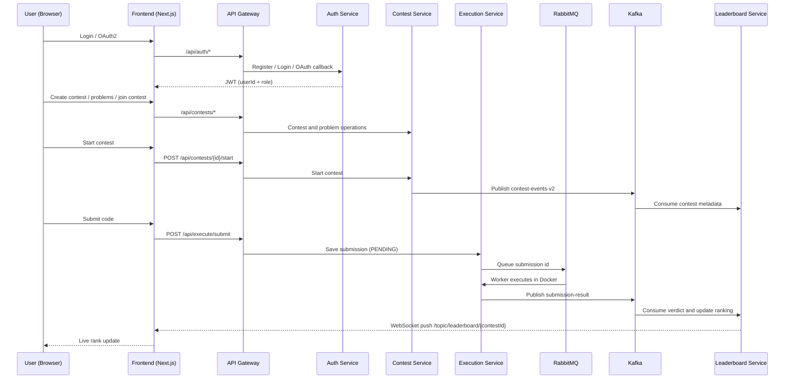

# ContestArena


A distributed, event-driven competitive programming platform built with Java microservices. Supports real-time leaderboards, OAuth2 authentication, sandboxed code execution across multiple languages, and Codeforces-style scoring and AI-driven contest analytics — designed as a production-grade learning system.

---

## What This Is

contest-manager is a full-stack competitive programming platform where users participate in timed coding contests, submit solutions in multiple languages, and track their rank on a live leaderboard that updates in real time.

It is built as a distributed system from the ground up — each concern is isolated into its own service with its own database, communicating through Kafka and RabbitMQ events. No shared databases. No synchronous service-to-service HTTP calls. Every service is independently deployable.

**New to this repo? Read this first.**

The platform has three logical layers:

- **Entry layer** — Frontend + API Gateway + Auth Service
- **Contest layer** — Contest and problem lifecycle management
- **Execution and ranking layer** — Code execution, event processing, real-time leaderboard

A typical user journey: sign in via OAuth2, join a contest, open a problem in the code editor, submit a solution, the code runs asynchronously in a Docker sandbox, the verdict is published to Kafka, and the leaderboard rank updates live in the browser via WebSocket — all without polling or page reload.

---

## System Architecture

```
                    +----------------------------------+
                    |    Next.js Frontend (3000)       |
                    +-------------+----------+---------+
                                  | REST     | WebSocket
                    +-------------v----------+
                    |    API Gateway (8080)   |
                    |  Spring Cloud Gateway   |
                    |  + Eureka Client        |
                    +--+-------+-------+------+
                       |       |       |
              +--------v-+ +---v---+ +-v---------+
              |   Auth   | |Contest| | Execution |
              | Service  | |Service| |  Service  |
              |  (8081)  | |(8082) | |  (8084)   |
              +----------+ +---+---+ +-----+-----+
                               |           |
                         Kafka |     RabbitMQ + Docker
                   contest-    |           |
                   events-v2   |     submission-result (Kafka)
                               |           |
                    +----------v-----------v-----------+
                    |       Leaderboard Service        |
                    |            (8085)                |
                    |   PostgreSQL + Redis + WebSocket |
                    +----------------------------------+

  Infrastructure: Eureka (8761) · PostgreSQL (5432)
                  Kafka (9092) · RabbitMQ (5672) · Redis (6379)
```

---

## End-to-End Data Flow



**Step by step:**

1. User authenticates via Google or GitHub OAuth2 — receives a JWT containing `userId` and `role`
2. API Gateway validates the JWT on every request and injects `X-User-Id` and `X-User-Role` headers downstream
3. Organizer creates a contest with problems and scores via Contest Service
4. Contest starts (manually or via scheduler) — Contest Service publishes `contest-events-v2` to Kafka
5. Leaderboard Service consumes the event and initialises contest state and problem scores
6. User submits code — Execution Service saves it as `PENDING` and pushes the job ID to RabbitMQ
7. RabbitMQ worker picks the job and runs the code in an isolated Docker container with resource limits
8. Execution Service publishes verdict to Kafka `submission-result` topic
9. Leaderboard Service consumes the verdict, computes Codeforces-style score and penalty, updates Redis sorted set, broadcasts rank change over WebSocket
10. Frontend receives the WebSocket push and animates the leaderboard update in real time

---

## Why This Architecture

| Decision | Reason |
|---|---|
| API Gateway | Single stable entry point. JWT validation and header injection happen once, not in every service. |
| Eureka service discovery | Services find each other by name, not hardcoded host/port. Enables independent scaling. |
| RabbitMQ for execution queue | Buffers submission spikes. Workers pull at their own pace — the API never blocks waiting for code to run. |
| Kafka for event streaming | Decouples producers (contest, execution) from consumers (leaderboard). Each service evolves independently. Multiple consumers can subscribe to the same event. |
| Redis sorted sets for ranking | O(log n) rank lookups and updates. Leaderboard reads never touch PostgreSQL during a live contest. |
| PostgreSQL per service | No shared databases. True domain isolation — each service owns its data completely. |
| Docker per execution | Untrusted code runs in an isolated container with no network, no host access, and hard resource limits. Destroyed immediately after execution. |

---

## Services

| Service | Responsibility | Port | 
|---|---|---|---|
| **Eureka Server** | Service discovery and registry | 8761 |
| **API Gateway** | Routing, JWT validation, header injection | 8080 | 
| **Auth Service** | OAuth2 social login, JWT issuance, user identity | 8081 | 
| **Contest Service** | Contest lifecycle, problem management, Kafka publisher | 8082 | 
| **Execution Service** | Submission intake, RabbitMQ queue, Docker sandbox, Kafka publisher | 8084 | 
| **Leaderboard Service** | Real-time ranking, Redis sorted sets, WebSocket broadcast | 8085 |
| **Frontend** | Next.js UI — contest pages, Monaco editor, live leaderboard | 3000 |

Each backend service maintains its own PostgreSQL database. There are no shared databases and no synchronous inter-service HTTP calls.

---
## AI-Powered Contest Analytics

Based on the JSON data, the Gemini model can generate the following insights:

- **The Decisive Problem:** Identify which problem acted as the main separator among the top participants. For example, if Problem C had an acceptance rate of only 12%, it may have been the ultimate tie-breaker for the top 10% of contestants.

- **Time Management Analysis:** Examine how the winner's submission strategy contributed to their rank. For example, solving Problems A and B very quickly to reduce penalty time may have been the key factor behind their victory.

- **Difficulty Calibration:** Provide feedback for contest organizers by comparing the intended difficulty of a problem with its actual performance. For instance, a problem labeled as "Medium" may have statistically behaved like a "Hard" problem if very few participants solved it.

---
## Tech Stack

| Layer | Technology |
|---|---|
| Language | Java 21 |
| Framework | Spring Boot 3.3.6 |
| Service Discovery | Netflix Eureka (Spring Cloud) |
| API Gateway | Spring Cloud Gateway |
| Authentication | Spring Security + OAuth2 Client + JJWT |
| Async Queue | RabbitMQ — submission buffering |
| Event Streaming | Apache Kafka 3.7 / Spring Kafka 3.2.5 |
| Cache / Ranking | Redis 3.0 — sorted sets via Lettuce |
| Code Execution | Docker — language-specific sandboxed runners |
| Database | PostgreSQL 16 — one database per service |
| ORM | Spring Data JPA / Hibernate 6.5 |
| Real-time | Spring WebSocket + STOMP over SockJS |
| Frontend | Next.js 15 + Monaco Editor |
| Build | Maven 3.9+ |
| Utilities | Lombok |

---

## Kafka Topics

| Topic | Producer | Consumer | Purpose |
|---|---|---|---|
| `contest-events-v2` | Contest Service | Leaderboard Service | Contest started — problem metadata and scores |
| `submission-result` | Execution Service | Leaderboard Service | Verdict — AC, WA, TLE, MLE, CE, RE |

---

## API Gateway Routing

All client traffic flows through the gateway at `localhost:8080`.

| Gateway Path | Routes To | Strip Prefix |
|---|---|---|
| `/api/auth/**` | `auth-service` | `/api/auth` |
| `/api/contests/**` | `contest-service` | `/api` |
| `/api/leaderboard/**` | `leaderboard-service` | `/api` |
| `/api/execute/**` | `execution-service` | `/api` |

The gateway extracts `userId` and `role` from the JWT and forwards them as `X-User-Id` and `X-User-Role` headers. Downstream services trust these headers and never re-validate the token themselves.

---

## Authentication

Auth Service is the sole source of user identity. No other service stores credentials or validates tokens.

**OAuth2 flow:**
```
GET /oauth2/authorization/{google|github}
  -> Provider login page
  -> Callback: /login/oauth2/code/{provider}
  -> User upserted in auth_db
  -> JWT generated
  -> Redirect: http://localhost:3000/oauth2/redirect?token={JWT}
```

**JWT claims:**
```json
{
  "sub": "user@email.com",
  "userId": "uuid",
  "role": "USER",
  "exp": 1711320967
}
```

The `userId` claim is the global user identity across all services. Frontend stores the JWT and sends it as `Authorization: Bearer <token>` on every request.

---

## Scoring System

The platform implements a **Codeforces-style scoring model**.

```
earnedScore = max(baseScore - (50 x wrongAttempts), baseScore x 0.3)
```

```
penalty = minutesElapsed + (wrongAttempts x 10)
```

Penalty is only activated at the moment of AC. Wrong attempts before AC are counted silently — if a user never solves a problem, their wrong attempts have no effect on the leaderboard.

| Wrong Attempts | Score (base = 500) |
|---|---|
| 0 | 500 |
| 1 | 450 |
| 2 | 400 |
| 3 | 350 |
| 8+ | 150 (30% floor) |

Ranking: higher `totalScore` first, lower `totalPenalty` as tiebreaker.

**Redis sorted set formula** — inverted so Redis ascending order maps to leaderboard rank:
```
redisScore = (10,000,000 - totalScore) x 1,000 + totalPenalty
```

O(log n) rank lookups. Leaderboard reads never touch PostgreSQL during a live contest. If Redis is flushed, the DB fallback auto-resyncs on the next request — zero manual intervention.

---

## Code Execution Sandbox

Each submission runs in a short-lived Docker container with strict isolation:

```
--network none          -> no internet access
--memory 256m           -> memory hard limit
--memory-swap 256m      -> no swap
--pids-limit 50         -> prevents fork bombs
--read-only filesystem  -> no host write access
```

**Supported languages:** Java · Python · C · C++ · JavaScript

Each language has a dedicated Docker runner image. Containers are destroyed immediately after execution. The execution pipeline is fully asynchronous — submissions queue via RabbitMQ and the API returns immediately.

**Verdict classification:** `AC` · `WA` · `TLE` · `MLE` · `CE` (compile error) · `RE` (runtime error)

---

## Running Locally

### Prerequisites

| Requirement | Version |
|---|---|
| Java | 21 |
| Maven | 3.9+ |
| PostgreSQL | 16 |
| Apache Kafka | 3.7+ |
| RabbitMQ | 3.x+ |
| Redis | 3.0+ |
| Docker Desktop | 20+ |
| Node.js | 18+ |

### 1. Start infrastructure

```bash
cd infra
docker compose up -d
```

This starts PostgreSQL, Kafka, Zookeeper, RabbitMQ, and Redis.

RabbitMQ management UI: `http://localhost:15672` (guest / guest)

### 2. Create databases

```sql
CREATE DATABASE auth_db;
CREATE DATABASE contest_db;
CREATE DATABASE execution_db;
CREATE DATABASE leaderboard_db;
```

### 3. Create Kafka topics

```bash
kafka-topics.bat --create --topic contest-events-v2 --bootstrap-server localhost:9092 --partitions 1 --replication-factor 1
kafka-topics.bat --create --topic submission-result  --bootstrap-server localhost:9092 --partitions 1 --replication-factor 1
```

### 4. Set environment variables

```bash
export GOOGLE_CLIENT_ID=your_google_client_id
export GOOGLE_CLIENT_SECRET=your_google_client_secret
export GITHUB_CLIENT_ID=your_github_client_id
export GITHUB_CLIENT_SECRET=your_github_client_secret
export JWT_SECRET=your_base64_secret
```

### 5. Build Docker execution runners

```bash
cd dockercompilers
docker build -t java-runner       -f java-runner/Dockerfile .
docker build -t python-runner     -f python-runner/Dockerfile .
docker build -t c-runner          -f c-runner/Dockerfile .
docker build -t cpp-runner        -f cpp-runner/Dockerfile .
docker build -t javascript-runner -f javascript-runner/Dockerfile .
```

### 6. Start services in order

```bash
# 1. Service registry — start first
cd eureka-server && mvn spring-boot:run

# 2. API Gateway
cd api-gateway && mvn spring-boot:run

# 3. Auth Service
cd auth-service && mvn spring-boot:run

# 4. Contest Service
cd contest-service && mvn spring-boot:run

# 5. Execution Service
cd execution-service && mvn spring-boot:run

# 6. Leaderboard Service
cd leaderboard-service && mvn spring-boot:run
```

### 7. Start frontend

```bash
cd frontend
npm install
npm run dev
```

Frontend at `http://localhost:3000`

**Optional frontend environment overrides:**
```bash
NEXT_PUBLIC_API_BASE_URL=http://localhost:8080
NEXT_PUBLIC_WS_URL=http://localhost:8085/ws
```

---

## Quick Sanity Test

Once all services are running:

1. Register or log in from the frontend
2. Create a contest and add problems with scores
3. Assign problems to the contest
4. Start the contest
5. Submit a solution from the code editor
6. Verify status transitions: `PENDING -> RUNNING -> ACCEPTED / WRONG_ANSWER`
7. Verify the leaderboard updates live via WebSocket without page refresh

---

## Service Documentation

Each service has its own README with full schema, API reference, Kafka contracts, configuration, and design decisions.

| Service | README |
|---|---|
| Auth Service | [Prashanth291/auth-service](https://github.com/Prashanth291/auth-service) |
| Contest Service | [Prashanth291/contest-service](https://github.com/Prashanth291/contest-service) |
| Execution Service | [klsharsha/execution-service](https://github.com/klsharsha/execution-service) |
| Leaderboard Service | [Prashanth291/leaderboard-service](https://github.com/Prashanth291/leaderboard-service) |
| Frontend | [Prashanth291/contest-arena-frontend](https://github.com/Prashanth291/contest-arena-frontend) |

---

## Key Design Decisions

**Event-driven over synchronous HTTP**
Services never call each other directly. All cross-service communication is asynchronous through Kafka and RabbitMQ. A service crash does not cascade — consumers simply lag and catch up when the service recovers.

**One database per service**
No service reads another service's database. The Leaderboard Service maintains its own copy of contest metadata, populated from Kafka events rather than querying Contest Service's database. This is the defining characteristic of true microservice isolation.

**Two message brokers for two different purposes**
RabbitMQ handles the submission execution queue — a task queue where each job must be processed exactly once by one worker. Kafka handles event streaming — where multiple consumers need to react to the same event. Using the right tool for each pattern is a deliberate choice, not over-engineering.

**Redis for live ranking, PostgreSQL for durability**
During a live contest, every leaderboard read is served from a Redis sorted set. PostgreSQL is the persistent source of truth. If Redis is flushed or restarts, the next read automatically resyncs from the database — zero manual recovery required.

**Penalty activated only at AC**
Wrong attempts accumulate silently. If a user never solves a problem, their wrong attempts have no effect on ranking. This matches the Codeforces model — the leaderboard reflects outcomes, not attempts.

**Docker sandbox per execution**
Each submission gets its own container, created from a clean image and destroyed after execution. No state is shared between executions. Resource limits at the container level enforce time and memory constraints independently of the host OS.

**UUID user identity across all services**
Auth Service assigns each user a UUID at registration. This UUID flows through all services via JWT claims and HTTP headers. No service stores passwords. No service has access to OAuth credentials.

---

## Repository Structure

```
contest-manager/
├── eureka-server/              # Service discovery registry
├── api-gateway/                # Spring Cloud Gateway, JWT validation
├── auth-service/               # OAuth2, JWT, user identity
├── contest-service/            # Contest and problem management
├── execution-service/          # Submission intake, RabbitMQ, Docker execution
├── leaderboard-service/        # Kafka consumers, ranking engine, WebSocket
├── frontend/                   # Next.js application
├── dockercompilers/
│   ├── java-runner/
│   ├── python-runner/
│   ├── c-runner/
│   ├── cpp-runner/
│   └── javascript-runner/
└── infra/                      # Docker Compose for local infrastructure
```

---

## Roadmap

- [x] Auth Service — OAuth2, JWT, user identity
- [x] Contest Service — contest and problem lifecycle, Kafka publisher
- [x] Leaderboard Service — scoring engine, Redis ranking, WebSocket broadcast
- [ ] Execution Service — Docker sandbox runners, RabbitMQ worker
- [ ] Frontend — contest pages, Monaco code editor, live leaderboard UI
- [ ] API Gateway — JWT validation middleware, rate limiting
- [ ] Admin panel — contest and problem management UI
- [ ] WebSocket-based live execution output streaming
- [ ] Kubernetes manifests for production deployment

---

## Known Notes

- Spring Boot versions differ across services — Auth uses 4.0.4, Contest and Leaderboard use 3.3.6. These are independent deployables so this causes no runtime issue, but worth aligning before production hardening.
- The Execution Service currently maps all non-AC results to `WA` for leaderboard purposes — full verdict classification (TLE, MLE, CE, RE) is in progress.
- API Gateway and Eureka modules use snapshot Spring Cloud versions in development — pin to stable releases before deployment.

---

## Related Work

The Execution Service builds on **CompileEngine** — an earlier standalone project that implemented the full Docker sandboxing and async execution pipeline with RabbitMQ. contest-manager integrates that system into the broader distributed platform by wiring it into Kafka, giving the Leaderboard Service real-time verdicts and enabling the live ranking system.

---

## License

Personal learning project. Not licensed for commercial use.
